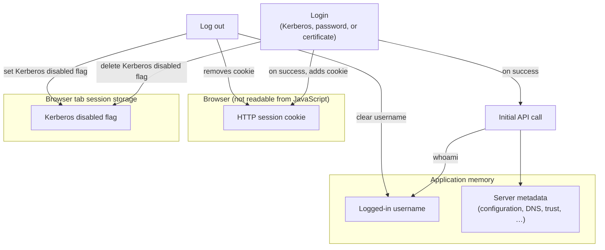
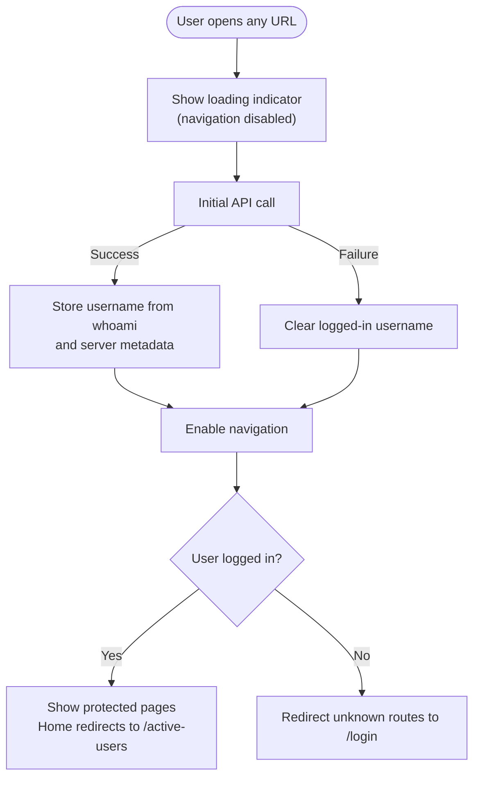

# Login and session state management

## Overview

The Modern WebUI authenticates against the FreeIPA server using the same session endpoints as the legacy WebUI. The browser holds an HTTP session cookie issued by the server. We can't access the cookie from JavaScript, therefore our only way of knowing whether the user is logged in is to call any API endpoint — because we need metadata of the user as well as the server configuration as the first thing, we use that call exactly for that (further referenced as **initial API call**).

The logged-in username is kept in application memory. It is populated from the `whoami` command included in the initial API call. This command is described in detail here: https://www.freeipa.org/page/V4/Who_Am_I_Command. The username is cleared on log out.

The cookie can also be removed without the application knowing about it; however, in the same browser tab that should only happen during log out. We don't properly check for this.

**Auto login** runs on every full application load, before navigation is enabled. The initial API call is made first; if it succeeds, the user is treated as logged in and protected pages become available. If it fails, the user is treated as unauthenticated and redirected to `/login`. While the initial API call is in progress, navigation must stay disabled — otherwise the application may redirect to `/login` before the response arrives, and then redirect again to `/active-users` once login is confirmed (for example: `/my-page` → `/login` → `/active-users`).

When the user reaches `/login`, they can sign in manually. Pressing **Log in** without entering a username attempts Kerberos authentication. Entering credentials attempts password authentication. A separate action attempts certificate authentication. After any of these succeeds, the initial API call is repeated to load the username and server metadata; only then can the user access protected routes. More details on the post-logout Kerberos behaviour are in [Kerberos authentication](#kerberos-authentication).

### State model

## Application startup (auto login)

On every full page load, the application shows a loading indicator and waits for the initial API call to finish. Only after that does navigation become active, which prevents premature redirects.

## Manual login on `/login`

Within an already-running application (for example after log out), the initial API call is **not** repeated when the user lands on `/login`. Instead, the login page may attempt automatic Kerberos authentication or wait for the user to choose a method.

## Log out

When logging out, a log out API call is performed; this removes the HTTP session cookie. If the call succeeds, the application clears the logged-in username from memory. The user is immediately treated as unauthenticated and redirected from protected pages to `/login`. Upon reaching `/login`, automatic Kerberos login is suppressed so the user is not silently signed back in. See [Kerberos authentication](#kerberos-authentication).

### Kerberos authentication

After log out, the HTTP session cookie is gone but the operating system or browser may still hold valid Kerberos tickets. When the user is sent to `/login`, the page normally tries Kerberos login automatically. Without a safeguard, that would silently create a new session and send the user back to `/active-users` — even though they intended to log out.

To prevent this loop, a **Kerberos disabled flag** is stored in the browser tab's session storage when log out succeeds. While the flag is set, automatic Kerberos login on `/login` is skipped. The flag is deleted after any successful manual login (Kerberos, password, or certificate).

Because the flag lives in session storage, a **full page reload** must be avoided after log out — reloading clears session storage, removes the flag, and can trigger automatic Kerberos login again.
